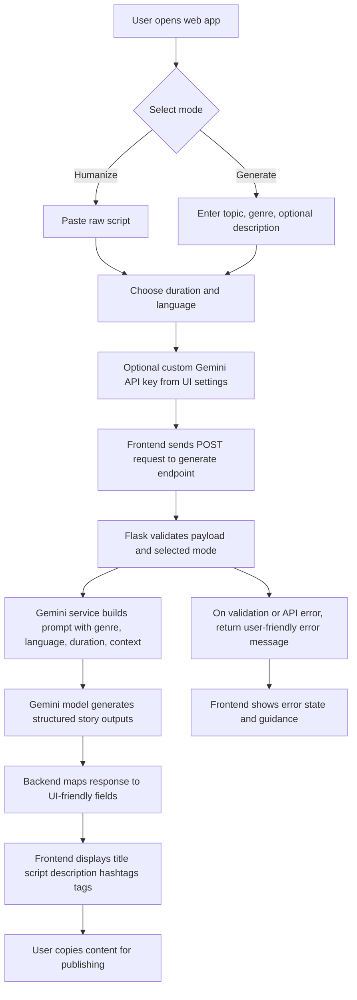
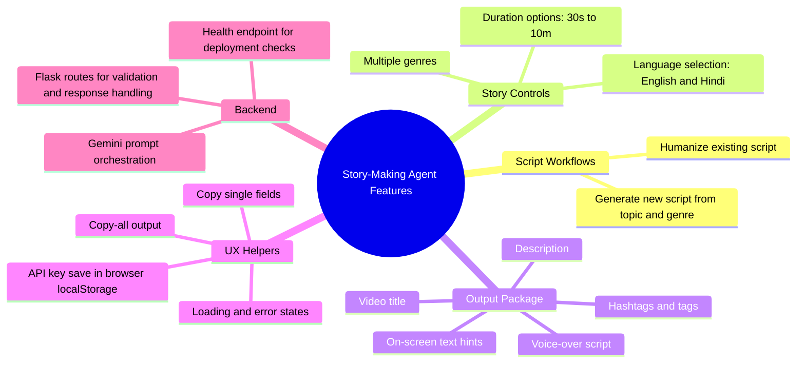

# Story-Making Agent (PromptPerfect)

A Flask + Gemini powered story-script assistant for short-form creators. The app helps users either **humanize an existing script** or **generate a new story script** from topic + genre, then returns YouTube-ready outputs (title, narration script, description, hashtags, and tags).

## Why this project was made
Short-video creators often lose time on repetitive prompt writing, rewriting stiff drafts, and reformatting output for YouTube.

This project was built to reduce that friction by combining:
- prompt structuring for storytelling,
- genre-aware script shaping,
- duration-aware pacing,
- and output formatting in one workflow.

In short, it addresses the pain of turning rough ideas/text into publishable, engaging short-video script packages quickly.

## Who this project helps
- **YouTube Shorts creators**: quickly generate or polish scripts optimized for short-form storytelling.
- **Content writers/script editors**: transform raw drafts into more natural, audience-friendly narration.
- **Social media teams/solo marketers**: speed up content iteration with reusable structured outputs (title, description, hashtags).
- **Developers building AI content tools**: use this repository as a practical Flask + Gemini reference for generation/humanization flows.

## What problem this project solves
### Problem statement
Content creators need fast, repeatable ways to go from idea (or rough text) to strong short-video script assets, but manual drafting and prompt tuning is inconsistent and time-consuming.

### Solution approach in this repo
This repository provides a web workflow with two modes:
1. **Humanize mode**: rewrites user-provided script text into more natural storytelling narration.
2. **Generate mode**: creates script output from topic, genre, optional context, duration, and language.

Backend routes validate inputs, call Gemini-based generation logic, and return structured JSON consumed by the frontend UI.

## Project flow diagram


## Feature diagram


## Key features
- Two creation paths: **Humanize** and **Generate**
- Genre-guided storytelling output
- Duration-aware script targeting
- Currently supports English/Hindi language selection in the Flask app flow
- Structured output for publishing workflows
- Optional per-user Gemini API key from UI

## Tech stack
- **Backend:** Python, Flask
- **AI:** Google Gemini API (`google-generativeai`)
- **Frontend:** HTML templates, Bootstrap UI, Vanilla JavaScript
- **Deployment artifacts:** Vercel config + Python API entrypoint, plus local Flask app files

## Repository structure (high level)
```text
.
├── app.py and routes.py         # Local Flask app + routes
├── gemini_service.py            # Prompting and response shaping logic
├── api/index.py                 # Vercel-oriented API entrypoint
├── api/gemini_service.py        # API-side Gemini service copy
├── templates/ + static/         # Web UI templates, JS, CSS
├── frontend/frontend/           # Separate React/Vite frontend scaffold
├── test_api.py                  # Basic API function test script
└── vercel.json                  # Deployment routing/build config
```

## Setup
### 1) Clone and install Python dependencies
```bash
git clone https://github.com/mittal122/Story-Making-agent-PromptPerfect.git
cd Story-Making-agent-PromptPerfect
pip install -r requirements.txt
```

### 2) Configure environment variables
```bash
export GEMINI_API_KEY="your_gemini_api_key"
export SESSION_SECRET="your_session_secret"
```

### 3) Run the Flask app
```bash
python app.py
```

Open: `http://localhost:5000`

## Usage
1. Open the app.
2. Pick **Humanize** or **Generate** mode.
3. Fill required fields (script text OR topic+genre).
4. Choose duration and language.
5. Optionally add your Gemini API key in the UI settings.
6. Generate output and copy assets for publishing.

## API endpoints (current Flask app)
- `POST /generate` — main generation/humanization route
- `GET /` — web interface

Vercel API variant also exposes:
- `POST /api/generate`
- `GET /api/health`

## Future scope
- Better automated tests for route and response contracts
- Stronger unification between local app and `api/` service files
- More export options (templates/platform-specific bundles)

## Contributing
Contributions are welcome. Please open an issue first to discuss major changes.

## License
MIT License (as declared in project metadata).
